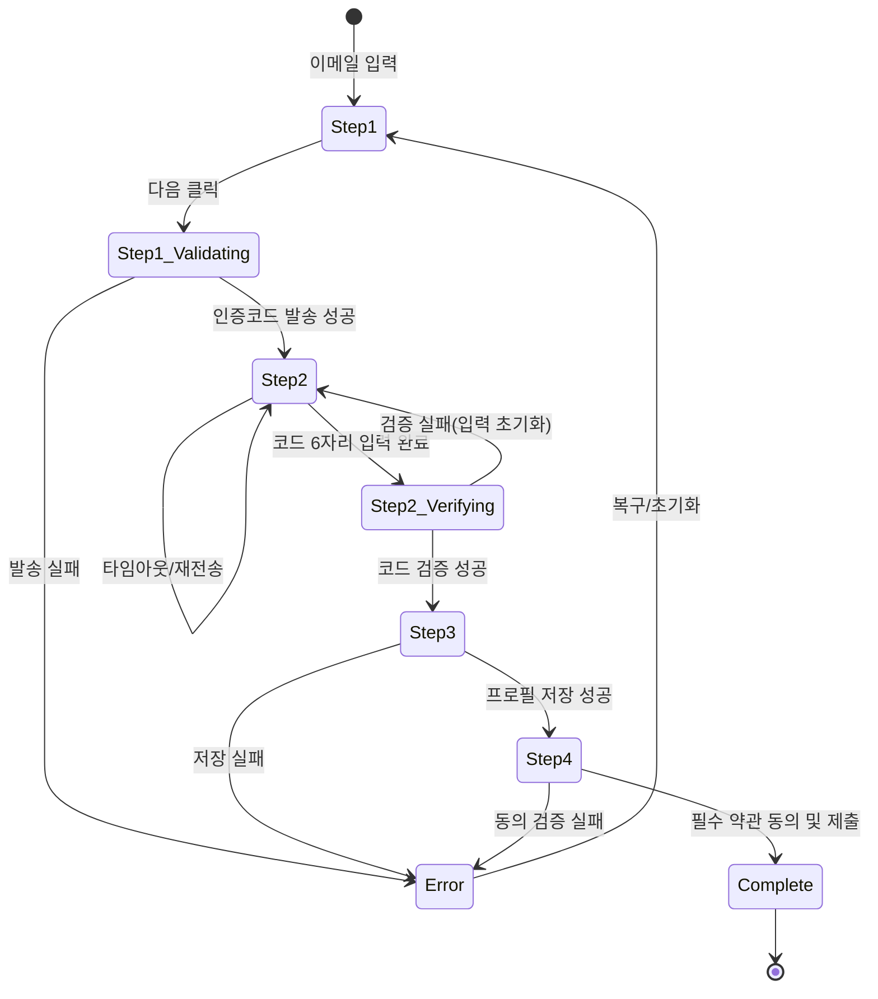

## 들어가며

1편에서 UI Flow Specification(UI Flow Spec)을 개념/템플릿으로 정리했고, 2편에서 코드를 향한 실전 패턴(XState, TanStack Query, Storybook, Playwright)을 소개했습니다. 이번 3편은 실제 사례로 "다단계 회원가입"을 UI Flow Spec 형식으로 서술합니다.

> 용어 주석: 본 글에서 사용하는 'UI Flow Specification'은 업계 표준 용어가 아니라, 필자가 Use Case와 구현 사이의 간극을 메우기 위해 제안하는 실무 템플릿입니다. 유사 산출물로는 UI/UX Spec, Interaction Spec, Statechart, Acceptance Criteria 등이 있습니다.

본 글은 학습/제안 단계의 초안이며, 팀 컨텍스트에 맞춰 수정/간소화를 전제로 합니다.

## 시나리오 개요

- **액터**: 사용자, 인증 서버(Auth API)
- **목표**: 신규 계정 생성(이메일 인증 + 프로필 입력 + 약관 동의)
- **성공 조건**: 인증 완료 및 필수 정보 수집 후 계정 생성 → 웰컴 페이지 진입
- **실패 조건**: 인증 실패/만료, 중복 계정, 필수 정보 누락, 네트워크 오류 등
- **가정(Assumptions)**:
  - 이메일 인증코드는 6자리, 유효기간 60초, 재전송 시 쿨다운 30초
  - 중복 이메일은 로그인 유도로 전환

## 상태/전이 요약(다이어그램)



## 상태별 상세 명세

```typescript
/**
 * UI Flow Specification: 다단계 회원가입 (Based on Use Case #21)
 * Component: SignupWizard.tsx
 * States: Step1 | Step1_Validating | Step2 | Step2_Verifying | Step3 | Step4 | Complete | Error
 */

/* ============================================
 * [Step1] 이메일 입력
 * ============================================ */

화면 요소:
  - 이메일 입력 필드(자동 포커스)
  - "다음" 버튼 (초기 비활성화)
  - 안내 텍스트

사용자 액션 1-1: 이메일 입력
  시스템 반응:
    → 포맷 유효 시 "다음" 버튼 활성화
    → 중복 이메일이면 에러 메시지 + "로그인하기" 링크 제공

사용자 액션 1-2: "다음" 버튼 클릭
  시스템 반응:
    → UI 상태: Step1 → Step1_Validating

/* ============================================
 * [Step1_Validating] 이메일 인증 요청
 * ============================================ */

화면 요소:
  - "다음" 버튼 로딩 상태
  - 이메일 입력 비활성화

시나리오 2a: 인증코드 발송 성공
  시스템 반응:
    → 인증코드 발송 API 호출
    → UI 상태: Step1_Validating → Step2 (이메일 표시, 타이머 60초 시작)

시나리오 2b: 인증코드 발송 실패
  시스템 반응:
    → 인증코드 발송 API 호출
    → UI 상태: Step1_Validating → Error("이메일 발송에 실패했습니다")

/* ============================================
 * [Step2] 인증코드 입력
 * ============================================ */

화면 요소:
  - 6자리 코드 입력창(자동 포커스/자동 이동)
  - 타이머(60초)
  - 재전송 버튼(쿨다운 30초)

사용자 액션 3-1: 6자리 입력 완료
  시스템 반응:
    → UI 상태: Step2 → Step2_Verifying

사용자 액션 3-2: 타임아웃 후 재전송 클릭
  시스템 반응:
    → 재전송 버튼 활성화 (쿨다운 해제) 및 발송 재시도 준비

/* ============================================
 * [Step2_Verifying] 인증코드 검증
 * ============================================ */

화면 요소:
  - 전체 입력 비활성화
  - 로딩 인디케이터

시나리오 4a: 코드 검증 성공
  시스템 반응:
    → UI 상태: Step2_Verifying → Step3

시나리오 4b: 코드 검증 실패
  시스템 반응:
    → 입력값 초기화 + 첫 칸 포커스 + 에러 메시지("코드를 다시 입력해 주세요")
    → UI 상태: Step2_Verifying → Step2

/* ============================================
 * [Step3] 프로필 정보 입력
 * ============================================ */

화면 요소:
  - 닉네임/비밀번호/비밀번호 확인 필드
  - 유효성 에러 표시
  - "다음" 버튼

사용자 액션 5-1: 프로필 정보 입력(실시간 검증: 닉네임 중복/비밀번호 규칙)
사용자 액션 5-2: "다음" 버튼 클릭

시나리오 6a: 프로필 저장 성공
  시스템 반응:
    → UI 상태: Step3 → Step4

시나리오 6b: 프로필 저장 실패
  시스템 반응:
    → UI 상태: Step3 → Error("프로필 저장에 실패했습니다")

/* ============================================
 * [Step4] 약관 동의
 * ============================================ */

화면 요소:
  - 필수/선택 약관 체크박스(전체 동의 포함)
  - 제출 버튼

사용자 액션 7-1: 필수 약관 체크
사용자 액션 7-2: 제출 클릭

주의사항:
  - 필수 약관 미체크 시 제출 버튼 비활성화 유지

시나리오 8a: 제출 성공
  시스템 반응:
    → UI 상태: Step4 → Complete (웰컴 화면 이동)

시나리오 8b: 제출 검증 실패
  시스템 반응:
    → UI 상태: Step4 → Error("필수 약관 동의가 필요합니다")

/* ============================================
 * [Complete] 완료
 * ============================================ */

화면 요소:
  - 웰컴 페이지

시스템 반응:
  → 최종 상태(종료)

/* ============================================
 * [Error] 오류 공통 처리
 * ============================================ */

화면 요소:
  - 에러 배너/토스트
  - 재시도/초기화 버튼(컨텍스트에 따라)

시스템 반응:
  → 메시지 예시:
    - "이메일 발송에 실패했습니다"
    - "코드를 다시 입력해 주세요"
    - "프로필 저장에 실패했습니다"
    - "필수 약관 동의가 필요합니다"
  → 재시도 시: 이전 단계로 복귀(예: Step1 또는 Step2)
```

## 엣지/예외 처리
- 네트워크 오류: 각 검증/저장 단계에서 재시도 버튼과 피드백 제공
- 코드 만료: 타이머 0초 시 에러 배너 + 재전송 버튼 활성화
- 재전송 스팸: 쿨다운 30초 유지, 남은 시간 표시
- 뒤로가기/새로고침: Step1_Validating/Step2_Verifying 시 경고 표시
- 중복 계정: Step1에서 로그인 유도로 브랜치 제공

## Acceptance Criteria / 테스트 시나리오 초안

```typescript
import { test, expect } from '@playwright/test';

test('회원가입: 인증코드 타임아웃 후 재전송', async ({ page }) => {
  await page.goto('/signup');              // Step1
  await page.fill('input[name=email]', 'user@example.com');
  await page.click('button:has-text("다음")'); // Step1_Validating → Step2
  // 타이머를 빠르게 0으로 만드는 mocking이 가능하다고 가정
  await page.evaluate(() => (window as any).mockTimerToZero?.());
  await expect(page.getByRole('button', { name: '재전송' })).toBeEnabled();
});

test('회원가입: 코드 검증 실패 시 입력 초기화', async ({ page }) => {
  await page.goto('/signup');
  // ... Step2로 진입했다고 가정
  await page.fill('[data-testid=otp-1]', '1');
  await page.fill('[data-testid=otp-2]', '2');
  await page.fill('[data-testid=otp-3]', '3');
  await page.fill('[data-testid=otp-4]', '4');
  await page.fill('[data-testid=otp-5]', '5');
  await page.fill('[data-testid=otp-6]', '9'); // 서버는 실패 응답
  await expect(page.getByText('코드를 다시 입력해 주세요')).toBeVisible();
  await expect(page.getByTestId('otp-1')).toBeFocused();
});
```

## 데이터 플로우(초안)

```typescript
interface SignupFlowData {
  email?: string;
  code?: string;
  profile?: {
    nickname?: string;
    password?: string;
  };
  agreements?: {
    termsRequired?: boolean;
    marketingOptional?: boolean;
  };
}
```

## 협업/계약 포인트(초안)
- API
  - `POST /auth/code`(발송), `POST /auth/verify`(검증)
  - `POST /users/profile`(임시 저장), `POST /users`(최종 생성)
- 비즈니스 규칙
  - 코드 유효기간/쿨다운/중복 정책을 서버와 합의하여 상수로 공유

## 한계와 주의
- Use Case는 구현 독립적 문서이며, 본 문서는 그 빈곳(UI 상태/전이/피드백)을 보완합니다.
- 접근성(포커스 이동/스크린리더), 보안(코드 노출/재전송 정책), 성능(디바운스/캐싱)은 별도 가이드와 함께 검토.

## 마치며
학습/제안 단계에서 시작한 UI Flow Spec을 실제 사례로 전개해 보았습니다. 팀 컨텍스트에 맞춘 경량화/확장을 권장하며, 피드백 환영합니다.

### 다음 글 예고
- 사례 B: 실시간 협업(문서 편집) UI Flow Spec
