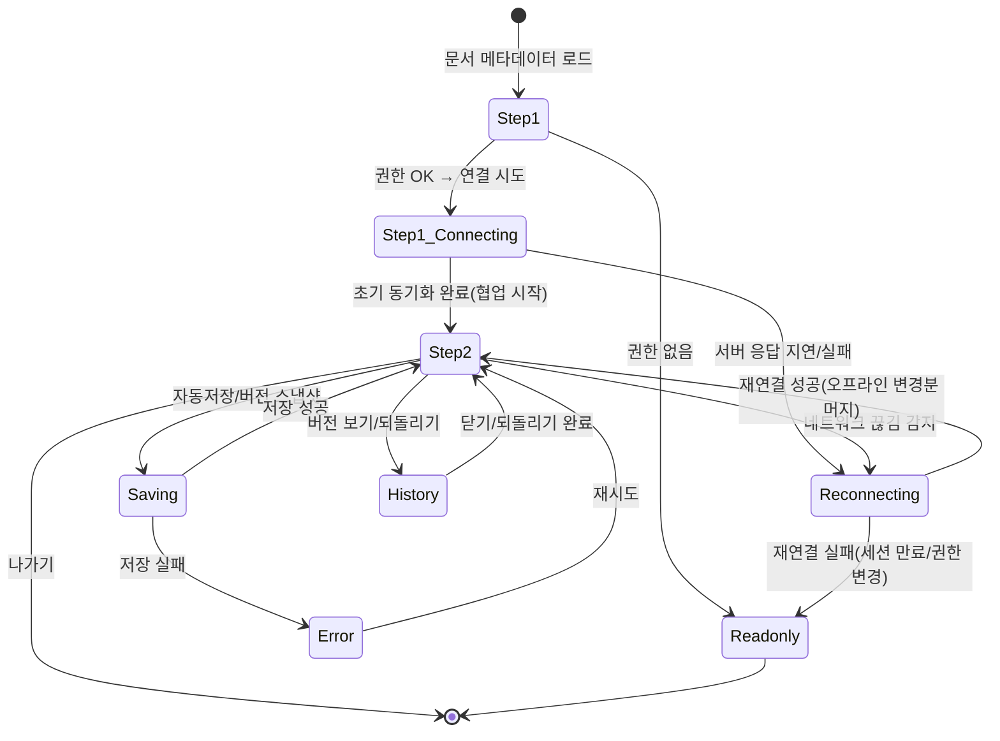

## 들어가며

1편에서 UI Flow Specification(UI Flow Spec)의 개념/템플릿을, 2편에서 실전 패턴(XState, TanStack Query, Storybook, Playwright)을, 3편에서 "다단계 회원가입" 사례를 정리했습니다. 이번 4편은 "실시간 협업(문서 편집)"을 UI Flow Spec 형식으로 서술하고, 바로 적용 가능한 예시 코드를 함께 제공합니다.

> 용어 주석: 본 글에서 사용하는 'UI Flow Specification'은 업계 표준 용어가 아니라, 필자가 Use Case와 구현 사이의 간극을 메우기 위해 제안하는 실무 템플릿입니다. 유사 산출물로는 UI/UX Spec, Interaction Spec, Statechart, Acceptance Criteria 등이 있습니다.

본 글은 학습/제안 단계의 초안이며, 팀 컨텍스트에 맞춰 경량화/확장을 전제로 합니다.

## 시나리오 개요

- **액터**: 사용자, 협업 서버(CRDT WebSocket), 인증 서버(Auth API)
- **목표**: 여러 사용자가 동일 문서를 실시간 공동 편집(커서/프레즌스/버전)
- **성공 조건**: 2명 이상 동시 접속 시 충돌 없이 동기화, 오프라인 복구, 버전 조회/되돌리기 가능
- **실패 조건**: 권한 없음, 연결 실패/끊김, 저장 실패, 세션 만료 등
- **가정(Assumptions)**:
  - CRDT로 Yjs 사용, 전송은 y-websocket, 에디터는 TipTap 기반(ProseMirror)
  - 오프라인 캐시는 y-indexeddb 활용, 자동 저장/버전 스냅샷 지원

## 상태/전이 요약(다이어그램)



## 상태별 상세 명세

```typescript
/**
 * UI Flow Specification: 실시간 협업(문서 편집)
 * Component: CollabEditor.tsx
 * States: Step1 | Step1_Connecting | Step2 | Saving | History | Reconnecting | Readonly | Error
 */

/* ============================================
 * [Step1] 문서 메타데이터 로드
 * ============================================ */

화면 요소:
  - 스켈레톤/로딩 인디케이터
  - 문서 제목/권한 정보 표시(로딩 후)

사용자 액션 1-1: 문서 페이지 진입(docId)
  시스템 반응:
    → GET /docs/:id(제목/권한/토큰) 조회
    → 권한이 edit이면 Step1 → Step1_Connecting
    → 권한이 view이면 Step1 → Readonly

/* ============================================
 * [Step1_Connecting] WebSocket 연결 및 초기 동기화
 * ============================================ */

화면 요소:
  - 연결 중 스피너, 상태 텍스트("서버에 연결 중...")

시나리오 2a: 연결 성공 + 초기 동기화 완료
  시스템 반응:
    → y-websocket Provider 연결, awareness 구독
    → IndexedDB 캐시 불러오며, 서버 동기화 완료 시 synced=true
    → UI 상태: Step1_Connecting → Step2

시나리오 2b: 연결 실패/타임아웃
  시스템 반응:
    → 재시도 지수백오프, 오프라인 모드 안내
    → UI 상태: Step1_Connecting → Reconnecting

/* ============================================
 * [Step2] 협업 편집(온라인)
 * ============================================ */

화면 요소:
  - TipTap 에디터(실시간 커서/프레즌스)
  - 참여자 목록(avatar, color)
  - 연결 상태 배지(online/offline/reconnecting)
  - 수동 저장 버튼(선택), 버전 보기 버튼

사용자 액션 3-1: 타이핑/서식 변경
  시스템 반응:
    → 로컬 변경이 Y.Doc에 적용되고 즉시 브로드캐스트
    → 오토세이브 타이머 기동 시 UI 상태: Step2 → Saving → Step2

사용자 액션 3-2: 버전 보기 클릭
  시스템 반응:
    → UI 상태: Step2 → History

/* ============================================
 * [Saving] 저장/스냅샷 처리
 * ============================================ */

화면 요소:
  - 상단 우측에 "저장 중..." 토스트/인디케이터

시나리오 4a: 저장 성공
  시스템 반응:
    → UI 상태: Saving → Step2

시나리오 4b: 저장 실패
  시스템 반응:
    → 에러 배너 표시("저장에 실패했습니다")
    → UI 상태: Saving → Error

/* ============================================
 * [History] 버전 보기/되돌리기
 * ============================================ */

화면 요소:
  - 버전 목록(작성자/시간/메시지)
  - 되돌리기 버튼

사용자 액션 5-1: 되돌리기 수행
  시스템 반응:
    → 서버 API로 스냅샷 적용 후 협업 문서에 머지
    → UI 상태: History → Step2

/* ============================================
 * [Reconnecting] 재연결(오프라인 지원)
 * ============================================ */

화면 요소:
  - 배너("오프라인 - 변경 내용은 로컬에 보관 중")

시나리오 6a: 재연결 성공
  시스템 반응:
    → 로컬 분기(IndexedDB)와 서버 최신 상태를 CRDT로 자동 머지
    → UI 상태: Reconnecting → Step2

시나리오 6b: 세션 만료/권한 변경
  시스템 반응:
    → UI 상태: Reconnecting → Readonly(재인증/권한 요청 안내)

/* ============================================
 * [Readonly] 읽기 전용
 * ============================================ */

화면 요소:
  - 에디터는 selection만 허용, 입력 비활성화
  - "권한이 없어 편집할 수 없습니다" 안내

/* ============================================
 * [Error] 오류 공통 처리
 * ============================================ */

화면 요소:
  - 에러 배너/토스트 + 재시도 버튼

시스템 반응:
  → 재시도 시 현재 컨텍스트에 따라 연결/저장 재시도
```

## Acceptance Criteria / 테스트 시나리오 초안

```typescript
import { test, expect } from '@playwright/test';

// 가정: window.__collab__ 객체에 provider 제어 유틸을 바인딩
//  - disconnect(): 강제 연결 해제
//  - connect(): 재연결 시도
//  - synced(): 현재 동기화 상태 반환

test('실시간 협업: 오프라인 → 재연결 시 로컬 변경분 머지', async ({ page }) => {
  await page.goto('/docs/alpha');              // Step1
  await expect(page.getByText('서버에 연결 중...')).toBeVisible();
  await expect(page.getByRole('textbox')).toBeVisible(); // Step2

  await page.getByRole('textbox').type('로컬 입력 A');
  await page.evaluate(() => (window as any).__collab__?.disconnect()); // Reconnecting
  await page.getByRole('textbox').type(' (오프라인에서 계속 입력)');

  await page.evaluate(() => (window as any).__collab__?.connect()); // Step2 복귀
  await expect(page.getByRole('textbox')).toHaveText(/로컬 입력 A.*오프라인에서 계속 입력/);
});

test('실시간 협업: 권한 없음은 읽기 전용으로 전환', async ({ page }) => {
  await page.goto('/docs/read-only');          // Step1 → Readonly
  await expect(page.getByText('권한이 없어 편집할 수 없습니다')).toBeVisible();
  await expect(page.getByRole('textbox')).toBeDisabled();
});
```

## 실제 코드 예제

### XState: 협업 연결/저장 상태 머신

```typescript
import { createMachine } from 'xstate';

interface CollabContext {
  docId: string;
  token?: string;
  canEdit: boolean;
  synced: boolean;
  error?: string;
}

type CollabEvent =
  | { type: 'LOAD'; docId: string }
  | { type: 'PERMISSION'; canEdit: boolean; token?: string }
  | { type: 'CONNECT' }
  | { type: 'CONNECTED' }
  | { type: 'DISCONNECTED' }
  | { type: 'SAVE' }
  | { type: 'SAVE_DONE' }
  | { type: 'SAVE_ERROR'; message: string }
  | { type: 'OPEN_HISTORY' }
  | { type: 'CLOSE_HISTORY' }
  | { type: 'SESSION_EXPIRED' }
  | { type: 'EXIT' };

export const collabMachine = createMachine({
  id: 'collab',
  initial: 'step1',
  context: { docId: '', canEdit: false, synced: false } as CollabContext,
  states: {
    step1: {
      on: {
        LOAD: {
          actions: ['assignDocId'],
        },
        PERMISSION: [
          { guard: (_, e) => e.canEdit, target: 'step1_connecting', actions: ['assignPermission'] },
          { guard: (_, e) => !e.canEdit, target: 'readonly', actions: ['assignPermission'] },
        ],
      },
    },
    step1_connecting: {
      entry: ['connectProvider'],
      on: {
        CONNECTED: { target: 'step2', actions: ['markSynced'] },
        DISCONNECTED: { target: 'reconnecting' },
      },
    },
    step2: {
      on: {
        SAVE: { target: 'saving' },
        OPEN_HISTORY: { target: 'history' },
        DISCONNECTED: { target: 'reconnecting' },
        SESSION_EXPIRED: { target: 'readonly' },
        EXIT: { target: 'step1' },
      },
    },
    saving: {
      entry: ['saveSnapshot'],
      on: {
        SAVE_DONE: { target: 'step2' },
        SAVE_ERROR: { target: 'error', actions: ['assignError'] },
      },
    },
    history: {
      on: {
        CLOSE_HISTORY: { target: 'step2' },
      },
    },
    reconnecting: {
      entry: ['scheduleReconnect'],
      on: {
        CONNECTED: { target: 'step2', actions: ['markSynced'] },
        SESSION_EXPIRED: { target: 'readonly' },
      },
    },
    readonly: {
      type: 'final',
    },
    error: {
      on: { SAVE: { target: 'saving' } },
    },
  },
}, {
  actions: {
    assignDocId: (ctx, e) => { (ctx as any).docId = (e as any).docId; },
    assignPermission: (ctx, e) => { (ctx as any).canEdit = (e as any).canEdit; (ctx as any).token = (e as any).token; },
    connectProvider: () => {},
    markSynced: (ctx) => { (ctx as any).synced = true; },
    saveSnapshot: () => {},
    assignError: (ctx, e) => { (ctx as any).error = (e as any).message; },
    scheduleReconnect: () => {},
  },
});
```

### React + TipTap + Yjs: 협업 에디터 구성

본 섹션의 단일 컴포넌트 구현은 중복을 방지하기 위해 'Provider 방식(권장): CollabProvider 컨텍스트'로 통합했습니다. 아래 섹션을 참고하세요.


### Provider 방식(권장): CollabProvider 컨텍스트

```tsx
import React, { createContext, useContext, useEffect, useMemo, useState, type ReactNode } from 'react';
import { useQuery } from '@tanstack/react-query';
import * as Y from 'yjs';
import { WebsocketProvider } from 'y-websocket';
import { IndexeddbPersistence } from 'y-indexeddb';
import { EditorContent, useEditor } from '@tiptap/react';
import StarterKit from '@tiptap/starter-kit';
import Collaboration from '@tiptap/extension-collaboration';
import CollaborationCursor from '@tiptap/extension-collaboration-cursor';

const WS_URL = 'wss://test.example/ws';
async function fetchDocMeta(docId: string) {
  const res = await fetch(`/api/docs/${docId}`);
  if (!res.ok) throw new Error('문서 정보를 불러오지 못했습니다');
  return res.json() as Promise<{ title: string; canEdit: boolean; token?: string; participants: number }>;
}

type CollabStatus = 'connected' | 'connecting' | 'disconnected';

type CollabContextValue = {
  ydoc: Y.Doc;
  provider: WebsocketProvider;
  status: CollabStatus;
  canEdit: boolean;
  connect: () => void;
  disconnect: () => void;
};

const CollabContext = createContext<CollabContextValue | null>(null);

export function CollabProvider({ docId, children }: { docId: string; children: ReactNode }) {
  const { data, isLoading, error } = useQuery({ queryKey: ['doc', docId], queryFn: () => fetchDocMeta(docId) });

  const ydoc = useMemo(() => new Y.Doc(), [docId]);
  const [status, setStatus] = useState<CollabStatus>('connecting');

  const provider = useMemo(
    () => new WebsocketProvider(WS_URL, docId, ydoc, { connect: false, params: { token: data?.token } }),
    [docId, ydoc, data?.token]
  );

  useEffect(() => {
    const persisted = new IndexeddbPersistence(`doc-${docId}`, ydoc);
    return () => persisted.destroy();
  }, [docId, ydoc]);

  useEffect(() => {
    if (!data) return;
    setStatus(data.canEdit ? 'connecting' : 'disconnected');
    if (data.canEdit) provider.connect();
    const onStatus = (e: any) => setStatus(e.status === 'connected' ? 'connected' : 'disconnected');
    provider.on('status', onStatus);
    (window as any).__collab__ = { disconnect: () => provider.disconnect(), connect: () => provider.connect(), synced: () => provider.synced };
    return () => {
      provider.off('status', onStatus);
      provider.disconnect();
      (window as any).__collab__ = undefined;
    };
  }, [data, provider]);

  const value: CollabContextValue = useMemo(
    () => ({
      ydoc,
      provider,
      status,
      canEdit: !!data?.canEdit,
      connect: () => provider.connect(),
      disconnect: () => provider.disconnect(),
    }),
    [ydoc, provider, status, data?.canEdit]
  );

  if (isLoading) return <div role="status" aria-busy="true">서버에 연결 중...</div>;
  if (error) return <div role="alert">문서를 불러오는 중 오류가 발생했습니다</div>;
  if (!data?.canEdit) return <div aria-readonly="true">권한이 없어 편집할 수 없습니다</div>;

  return <CollabContext.Provider value={value}>{children}</CollabContext.Provider>;
}

export function useCollab() {
  const ctx = useContext(CollabContext);
  if (!ctx) throw new Error('useCollab must be used within CollabProvider');
  return ctx;
}

export function CollabEditorSimplified({ user }: { user: { name: string; color: string } }) {
  const { ydoc, provider, status } = useCollab();
  const editor = useEditor({
    extensions: [
      StarterKit.configure({ history: false }),
      Collaboration.configure({ document: ydoc }),
      CollaborationCursor.configure({ provider, user }),
    ],
  });
  const statusText = status === 'connected' ? '온라인' : status === 'connecting' ? '서버에 연결 중...' : '오프라인';
  return (
    <div aria-label="협업 문서 편집기">
      <div aria-live="polite" role="status" className="sr-only">{statusText}</div>
      <EditorContent editor={editor} />
    </div>
  );
}
```

```tsx
// 문서 페이지에서의 사용 예시
export default function DocPage() {
  const user = { name: 'Alice', color: '#0ea5e9' };
  return (
    <CollabProvider docId="alpha">
      <Header />
      <CollabEditorSimplified user={user} />
    </CollabProvider>
  );
}

function Header() {
  const { status } = useCollab();
  const statusText = status === 'connected' ? '온라인' : status === 'connecting' ? '연결 중' : '오프라인';
  return <div className="mb-2 text-sm text-gray-600">상태: {statusText}</div>;
}
```

### Storybook: 상태별 Story 매핑

```tsx
import type { Meta, StoryObj } from '@storybook/react';
import React from 'react';
import { CollabProvider, CollabEditorSimplified } from './collab';

const meta: Meta<typeof CollabEditorSimplified> = {
  title: 'Features/Collaboration/CollabEditor',
  component: CollabEditorSimplified,
  decorators: [
    (Story) => (
      <CollabProvider docId="alpha">
        <Story />
      </CollabProvider>
    ),
  ],
};
export default meta;

export const Connected: StoryObj<typeof CollabEditorSimplified> = {
  args: { user: { name: 'Alice', color: '#0ea5e9' } },
};

export const Readonly: StoryObj<typeof CollabEditorSimplified> = {
  render: (args) => (
    <CollabProvider docId="read-only">
      <CollabEditorSimplified {...args} />
    </CollabProvider>
  ),
  args: { user: { name: 'Bob', color: '#f43f5e' } },
};
```

## 엣지/예외 처리
- **네트워크 끊김**: provider.status로 감지 → Reconnecting 배너, 자동 재연결 백오프, 로컬 보관
- **세션 만료**: 서버에서 401/403 또는 close code 특정 값 → Readonly 전환 + 재인증 유도
- **동시 권한 변경**: 관리자에 의해 편집 → 보기로 강등 시 입력 비활성화, 커서 제거
- **버전 충돌**: 스냅샷 되돌리기 직후 협업 변경 감지 → 되돌리기 진행 전 confirm
- **대용량 문서**: 초기 동기화 지연 → IndexedDB 선로딩, 부분 렌더, 상태 배지 표시

## 데이터 플로우(초안)

```typescript
interface CollabFlowData {
  docId: string;
  token?: string;
  canEdit: boolean;
  presence: Array<{ userId: string; name: string; color: string }>;
  autosaveIntervalMs: number;
  lastSavedAt?: number;
}
```

## 협업/계약 포인트(초안)
- **API**
  - `GET /api/docs/:id` → { title, canEdit, token }
  - `GET /api/docs/:id/history` → 버전 목록
  - `POST /api/docs/:id/restore` → 특정 버전 복구
- **WebSocket**
  - `wss://test.example/ws?token=:jwt` (room은 WebsocketProvider의 두 번째 인자에 docId로 전달)
  - provider.status 이벤트로 연결 상태 관찰
- **비즈니스 규칙**
  - 오토세이브 주기/스냅샷 정책을 서버와 합의해 상수 공유(예: 10초/1000 ops)

## 한계와 주의
- 보안: 토큰 스코프 최소화, 문서 별 토큰 발급/만료, 링크 공유 방지
- 성능: 대용량 문서 chunk sync, awareness 최소화, undo stack 관리
- 접근성: 협업 커서/배지의 ARIA 레이블, 색 대비 보장

## 마치며
실시간 협업은 상태/전이가 복잡하지만, UI Flow Spec으로 상태를 명시하고 XState/TanStack Query/TipTap+Yjs로 구현을 정렬하면 테스트 가능한 구조가 됩니다. 팀 컨텍스트에 맞춘 경량화/확장과 피드백을 환영합니다.
